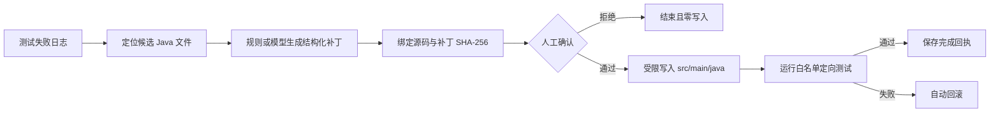

# TracePilot

TracePilot 是一个面向 Java 测试失败的受控修复 Agent。它从 Stack Trace 定位候选源码，生成最小补丁，展示 diff 并等待人工确认；只有确认通过后才允许写入生产源码，随后运行定向测试，失败时自动回滚。

本项目重点不是让大模型直接操作电脑，而是构建一个可限制、可恢复、可审计的 Agent Harness（运行时约束层）。模型只负责提出结构化补丁，路径校验、确认绑定、写入、测试、回滚和幂等回执都由确定性代码执行。

## 解决的问题

- 测试日志很长，开发者需要先定位可能出错的源码。
- 模型生成的补丁不能未经确认直接修改仓库。
- 确认后源文件可能已变化，旧补丁必须失效。
- 测试失败时不能留下半成品修改。
- 服务重启后要找回待确认任务；重复确认不能重复执行。

## 工作流



LangGraph 负责流程状态和中断恢复，SQLite 保存检查点与幂等回执；FastAPI 提供启动、查询和确认接口。模型模式通过 OpenAI 兼容接口接入，但模型没有文件写入或命令执行能力。

## 安全边界

- 只接受仓库内相对路径，拒绝 `..`、绝对路径、符号链接和 Windows 重解析点。
- 只读取允许的文本类型，只修改 `src/main/java/**/*.java`。
- 测试目标必须是 Java 类名格式，测试执行不经过 Shell。
- 补丁同时绑定源文件 SHA-256 与提案 SHA-256；确认后源文件变化则拒绝执行。
- 测试失败自动恢复原文件；执行回执状态不明确时停止自动重试并要求人工检查。

## 本地运行

要求 Python 3.11+ 和 JDK 17+。

```powershell
python -m venv .venv
.\.venv\Scripts\python.exe -m pip install -r requirements.txt
$env:TRACEPILOT_WORKSPACE_ROOT = "C:\path\to\java-project"
$env:TRACEPILOT_STATE_DIR = "C:\path\to\tracepilot-state"
$env:TRACEPILOT_JAVA = "C:\path\to\java.exe"
$env:TRACEPILOT_JAVAC = "C:\path\to\javac.exe"
.\.venv\Scripts\python.exe -m uvicorn tracepilot.main:app --port 8020
```

打开 `http://127.0.0.1:8020/docs` 查看 FastAPI 接口文档。默认 `TRACEPILOT_PLANNER=offline`，用于无外部 API 的可复现演示。

真实模型模式还需要：

```powershell
$env:TRACEPILOT_PLANNER = "model"
$env:TRACEPILOT_MODEL_BASE_URL = "https://provider.example/v1"
$env:TRACEPILOT_MODEL_API_KEY = "your-key"
$env:TRACEPILOT_MODEL = "your-model"
```

不要把密钥写入仓库。发送到模型的内容包含失败日志及最多 4 个候选源码文件，使用真实业务代码前应完成数据分级和供应商授权。

## API

- `POST /runs`：提交失败日志与白名单测试类，生成待确认补丁。
- `GET /runs/{run_id}`：查询状态、补丁、diff、工具轨迹和测试结果。
- `POST /runs/{run_id}/approval`：提交 `approved` 与补丁摘要；摘要必须与当前提案一致。

## 测试与评测

```powershell
.\.venv\Scripts\python.exe -m pytest
.\.venv\Scripts\python.exe -m scripts.run_evaluation `
  --java "C:\path\to\java.exe" `
  --javac "C:\path\to\javac.exe" `
  --output reports\offline-evaluation.json
```

固定评测集包含 12 类 Java 故障：空指针、边界条件、整数除法、字符串引用比较、BigDecimal 精度语义、空集合、循环越界、大小写、布尔条件和整数溢出等。每个案例都从原始夹具复制到临时目录，因此评测不会修改夹具。

当前离线报告见 [`reports/offline-evaluation.json`](reports/offline-evaluation.json)：12/12 原始案例先失败；12/12 定位并提出预期文件补丁；12/12 确认前零写入、重启后恢复、确认后测试通过，重复确认保持幂等。这里使用的是确定性规则规划器，**不能解释为真实大模型修复成功率**。

## 项目边界

- 当前测试运行器适配单模块 Javac 主类测试和 Maven 单测试类，尚未覆盖多模块构建图。
- 真实模型接口已实现并用模拟 HTTP 响应验证契约，但尚未在固定数据集上做外部模型修复评测。
- SQLite 适合个人演示；多实例服务应改用共享检查点与分布式执行回执。
